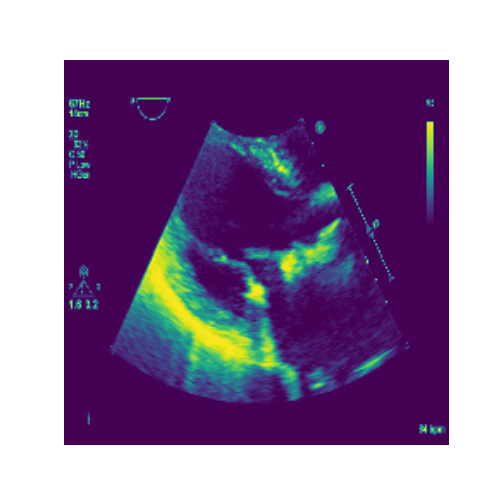
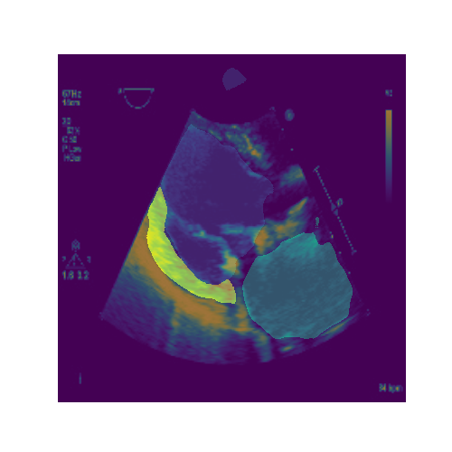

## This project was done as an employee for Thomas Jefferson University Hospital. The DICOM files can't be shared freely because of HIPPA regualations but trained model could be shared in the future.

## A flask application was created as an interface to the algorithm.

## The images are an example of the model input and output as a showcase. 

Original Frame             |  Segmentation Frame          |  Overlay Frame 
:-------------------------:|:-------------------------:|:-------------------------:
  |     |  